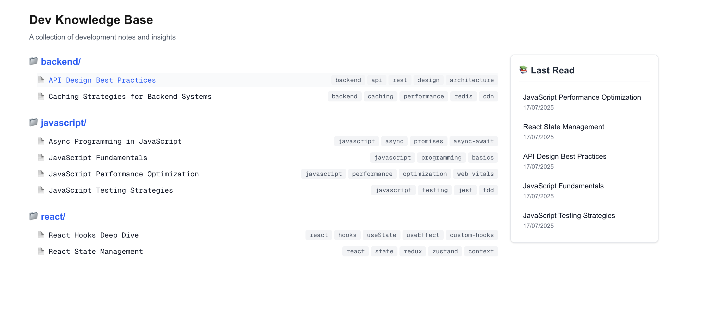
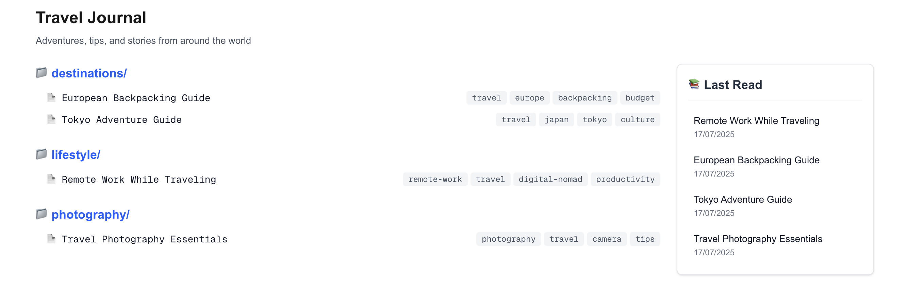
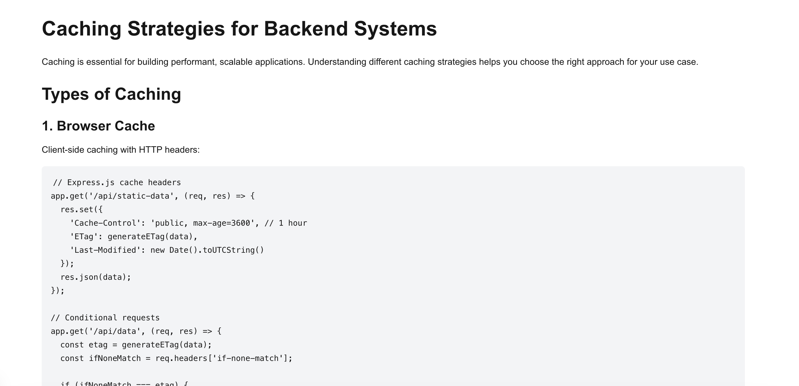

# Obsidian-Style Knowledge Base

A sample Next.js application that transforms an Obsidian vault of markdown files into a blog.

Transform your collection of markdown notes into a fully functional blog. Simply point the app to any folder containing markdown files and watch as your notes become a navigable website with a clean homepage listing all your articles.

Obsidian-style `[[internal linking]]` is preserved and transformed into clickable web links, maintaining the interconnected nature of your knowledge base. As you read through different articles, the app tracks your reading history in a convenient sidebar widget, helping you pick up where you left off.

## Live Demo

**[View Demo](https://obsidian-next-lmx3.vercel.app/)** - using the [dev-content](./dev-content) folder

## Demonstrated Skills

- **Next.js Rendering Strategy - Static Site Generation** -  SSG is used for the rarely changing content pages. Pages are pre-built at build time.
- **Client-side Rendering for user-specific features** - CSR is used for the user-specific and frequently updated feature of tracking reading history.
- **React Patterns** - Custom hooks to encapsulate state logic and localStorage persistence. 
- **TypeScript**
- **Library Integration** - integrated remark plugins to convert markdown into HTML.

## Screenshots

*A Dev Notes showing article listing with Last Read sidebar widget*


*A Travel Blog*


*Individual page*


## Getting Started

```bash
npm install
npm run dev
```

Open [http://localhost:3000](http://localhost:3000) to view the knowledge base.

## Configuration

To set your markdown folder, edit `src/config.ts`:

```typescript
export const siteConfig = {
  siteName: "Your Site Name",
  siteDescription: "Your description", 
  contentPath: "../your-content-folder",
  author: "Your Name"
};
```

The app will automatically scan for `.md` files in the specified folder and create routes based on the file structure.
For testing, we are using the folders `dev-content` shipped with this demo. Another folder `travel-content` is also provided.

## Future
- Image support (Not tested)
- Theming

## AI Use
- Content used for the blogs ( `content` & `travel-content` ) is completely AI-generated.
- AI assistance was leveraged for coding efficiency, but the project architecture, component design, and technical decisions are entirely my own.